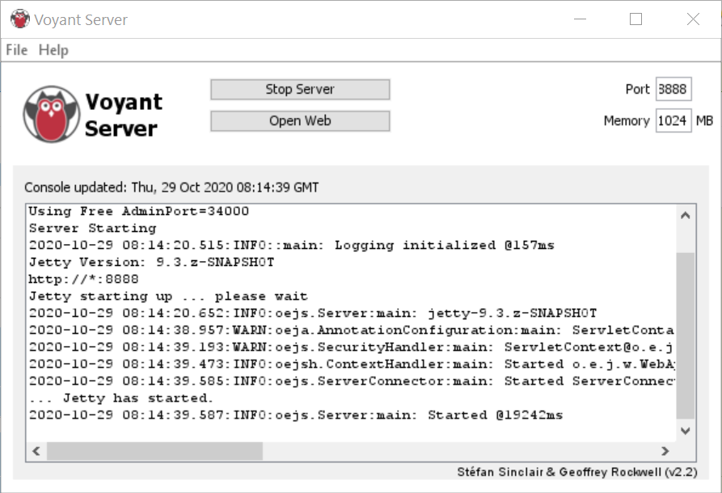
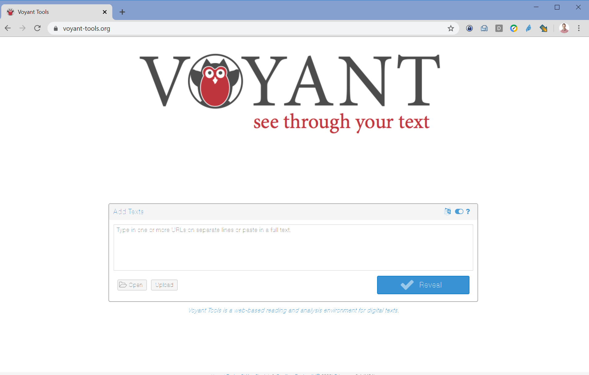

# Workshop preparation 
  
## 1. Get the data
- Download the [platforms-as-text](data/platforms-as-text.zip) zipfile to a working directory on your computer.
- Unzip it. 

## 2. Choose your Voyant Instance

For this workshop, you have the option to use Voyant Tools in one of two ways: 
- Using [Voyant on the web](https://voyant-tools.org/), which requires no setup (just open it in a browser).
- Downloading and running Voyant Tools on your local computer--this requires extra setup (see below), but eliminates the chance that network issues or high traffic on the Voyant website will slow you down. 

### Using Voyant on the web
1. Navigate to <https://voyant-tools.org/>. **You're ready!**

### Installing and running Voyant on Windows
1. Download [VoyantServer2_4-M45.zip](https://github.com/sgsinclair/VoyantServer/releases/download/2.4.0-M45/VoyantServer2_4-M45.zip) to your local computer from the [Voyant GitHub repository](https://github.com/sgsinclair/VoyantServer/releases/tag/2.4.0-M45)
2. Unzip the file. Be sure to actually extract the zip file -- do not just open it.
3. Open the unzipped file and double-click ```VoyantServer.jar```. On Windows 10, you may be prompted to Allow Access
4. A Voyant Server window should appear, and Voyant Tools should open in a browser window at localhost (http://127.0.0.1:8888)
    * If Voyant Tools do not open in a browser window, click 'Open Web' in the Voyant Server Window

### Installing and running Voyant on Mac OS
Installation steps may vary depending on MAC OS version. The full process is outlined below, which may not be necessary in your case: 
1. If you do not already have Java installed, download and install the Java SE Development Kit; you can download the most recent version at https://www.oracle.com/java/technologies/javase-jdk15-downloads.html.
    * You may wish to restart your computer before opening Voyant Server
2. Open Voyant Server by holding down Ctrl and clicking on VoyantServer.jar – from the menu, select “Open”
    * the first you open Voyant Server you may be prompted with a security warning; you can safely ignore it and continue with “Open” 
3. If you receive the error message ‘The Java JAR file “VoyantServer.jar” could not be launched,’ try the following:
    * Hold Ctrl and click on the folder that contains the VoyantServer.jar file, likely “VoyantServer2_4-M45” if you unzipped it without changing the folder name
    * From the menu, select “New Terminal at Folder” which will open a terminal window at the level of the directory
    * Type  java -jar VoyantServer.jar in the command line and press the Return key 
    * The Voyant Tools home page should open in your preferred web browser at localhost (<http://127.0.0.1:8888>)

***Voyant Server Window***


***Voyant Tools in a browser window***



